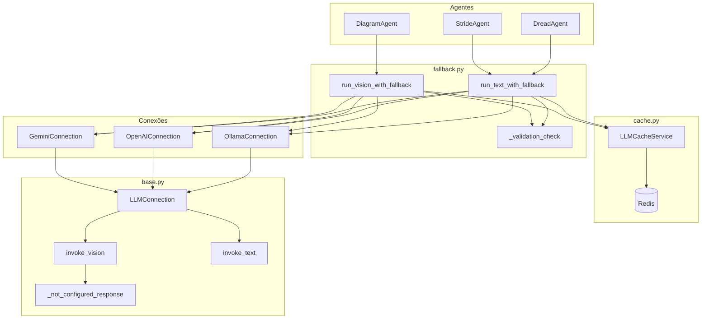
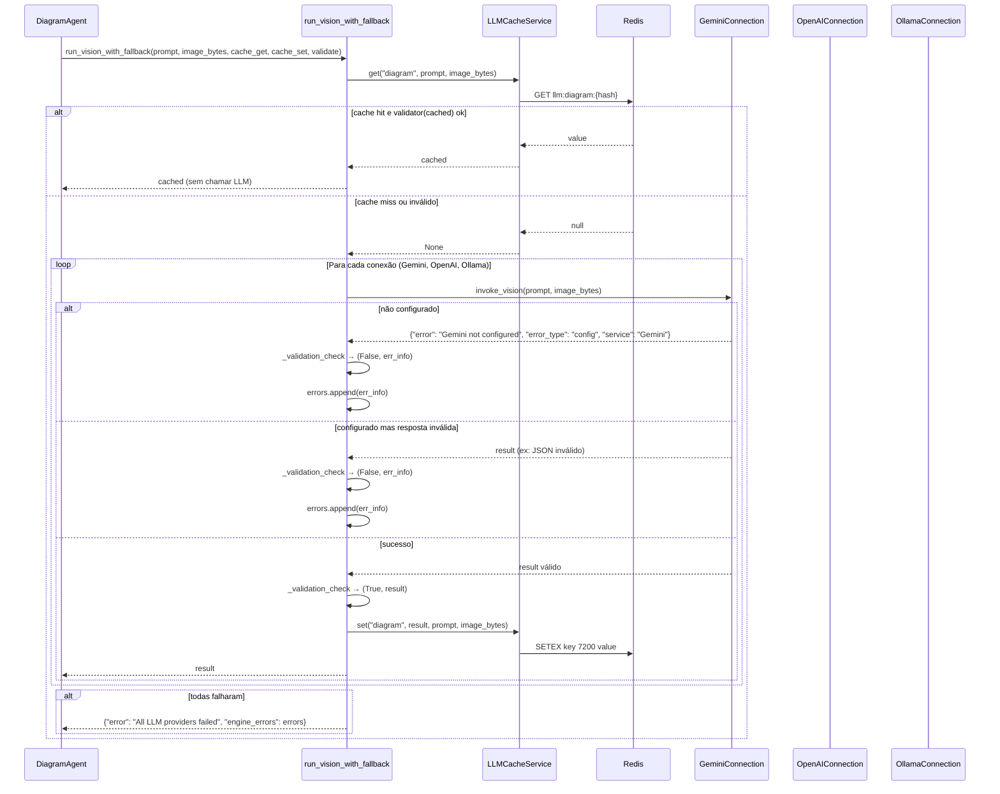

# Módulo LLM: Fallback e Resiliência

Este documento descreve a arquitetura do módulo `app.threat_analysis.llm`: múltiplos provedores de LLM com fallback automático, cache de respostas e tratamento uniforme de erros (não configurado, falha de API, validação).

---

## 1. Objetivo e motivação

O serviço de análise de ameaças depende de LLMs para:

- **Visão (imagem):** extrair componentes e conexões de um diagrama de arquitetura.
- **Texto:** gerar análise STRIDE e pontuação DREAD a partir de dados estruturados.

Qualquer provedor pode falhar ou não estar disponível:

- **Não configurado:** chave de API ausente ou inválida (Gemini, OpenAI); Ollama não rodando.
- **Falha temporária:** rate limit, timeout, indisponibilidade do serviço.
- **Resposta inválida:** JSON malformado ou que não passa na validação de negócio.

Por isso o módulo oferece:

1. **Fallback em cadeia:** uma lista ordenada de conexões (ex.: Gemini → OpenAI → Ollama); tenta a próxima se a atual falhar ou não entregar resultado válido.
2. **Cache (Redis):** evita chamadas repetidas para o mesmo input; TTL de 2 horas.
3. **Contrato único:** todas as conexões retornam um mesmo formato (dict com resultado ou `error` / `error_type` / `service`), permitindo tratar "não configurado" e "erro" da mesma forma no fallback.

Assim, o pipeline de análise continua funcionando mesmo com apenas um provedor disponível (por exemplo só Ollama local).

---

## 2. Visão geral da arquitetura

```
┌─────────────────────────────────────────────────────────────────────────────┐
│                           Agentes (Diagram, STRIDE, DREAD)                    │
│  • Definem ordem de conexões (ex: Gemini → OpenAI → Ollama)                  │
│  • Instanciam LLMCacheService(redis_url) e passam cache_get / cache_set      │
│  • Chamam run_vision_with_fallback ou run_text_with_fallback                 │
└─────────────────────────────────────────────────────────────────────────────┘
                    │
                    ▼
┌─────────────────────────────────────────────────────────────────────────────┐
│                              fallback.py                                     │
│  • run_vision_with_fallback(prompt, image_bytes, cache_*, validate)         │
│  • run_text_with_fallback(messages, cache_*, validate)                       │
│  • Consulta cache → se hit e válido, retorna; senão tenta cada conexão       │
│  • _validation_check(validator, result, conn_name) → (ok, value) ou err_info │
└─────────────────────────────────────────────────────────────────────────────┘
                    │
        ┌───────────┼───────────┐
        ▼           ▼           ▼
┌──────────────┐ ┌──────────────┐ ┌──────────────┐
│   cache.py   │ │   base.py    │ │ Conexões      │
│ LLMCacheService│ │ LLMConnection │ │ (gemini,     │
│ Redis, TTL 2h │ │ invoke_vision │ │  openai,     │
│ get/set(prefix,│ │ invoke_text   │ │  ollama)     │
│  *parts)     │ │ _invoke       │ │ _ensure_llm  │
│              │ │ _parse_json   │ │ _parse_json  │
└──────────────┘ │ _not_configured│ └──────────────┘
                 └──────────────┘
```

### Diagrama Mermaid: componentes



---

## 3. Fluxo de fallback (visão)

O fallback **não** verifica `is_configured()` antes de tentar cada conexão. Cada `invoke_vision` / `invoke_text` já trata "não configurado" internamente (retorna `_not_configured_response()`). Assim, erros de configuração entram naturalmente em `engine_errors` e o próximo provedor é tentado.

Fluxo resumido:

1. **Cache:** se `cache_get` estiver definido, consulta com a chave (prefix + input). Se houver valor e o `validator` aceitar, retorna e encerra.
2. **Para cada conexão na ordem:**
   - Instancia a conexão com `settings`.
   - Chama `invoke_vision` ou `invoke_text`.
   - Usa `_validation_check(validator, result, conn.name)`:
     - Se **válido:** grava no cache (se `cache_set`), retorna o resultado.
     - Se **inválido:** monta `err_info` (engine + error) e adiciona a `errors`.
   - Se **exceção** durante a chamada: adiciona à `errors` e continua para a próxima conexão.
3. Se todas falharem, retorna `{"error": "All LLM providers failed", "engine_errors": errors}`.

---

## 4. Diagrama de sequência: Vision com fallback e cache



---

## 5. Fluxo de validação (\_validation_check)

O helper `_validation_check(validator, result, conn_name)` centraliza:

- Chamar o `validator(result)` (ex.: diagrama com `components` e sem `error`).
- Se **True:** retornar `(True, result)` para o fallback gravar no cache e retornar.
- Se **False:** montar `err_info` (incluindo `engine: conn_name`) e retornar `(False, err_info)` para ser adicionado a `errors`.

Se o `validator` **lançar exceção**, ela propaga e é capturada pelo `except` do loop do fallback, que adiciona `{"engine": conn.name, "error": str(e), "error_type": "exception"}` a `errors`. Assim, validação com lançamento de erro e validação por retorno booleano ficam cobertas.

---

## 6. Conexões (LLMConnection)

Todas as conexões estendem `LLMConnection` e implementam:

| Responsabilidade    | Onde fica        | Descrição                                                                                                          |
| ------------------- | ---------------- | ------------------------------------------------------------------------------------------------------------------ |
| Nome e configuração | Subclasse        | `name`, `is_configured()`                                                                                          |
| Cliente LLM         | Subclasse        | `_ensure_llm()` (lazy), retorna `None` se não configurado                                                          |
| Invocação           | Base             | `invoke_vision`, `invoke_text` (chamam `_ensure_llm`, depois `_invoke`)                                            |
| "Não configurado"   | Base             | `_not_configured_response()` → `{"error": f"{self.name} not configured", ...}`                                     |
| Execução e parsing  | Base + subclasse | Base: `_invoke(coro)` (timer, log, `_parse_json(text)`). Subclasse: `_parse_json(text)` (extrair JSON da resposta) |

Ordem típica usada pelos agentes:

1. **Gemini** (primário)
2. **OpenAI** (fallback)
3. **Ollama** (fallback local, sem API key)

Assim, se o Gemini não estiver configurado ou falhar, o fluxo segue para OpenAI e depois Ollama sem checagem prévia de `is_configured()` no fallback.

---

## 7. Cache (Redis)

- **Backend:** Redis; URL configurável por `settings.redis_url` (ex.: `redis://localhost:6379/0`).
- **TTL:** 2 horas (`CACHE_TTL_SECONDS = 7200`).
- **Chave:** `llm:{prefix}:{sha256(parts)}` (prefix ex.: `"diagram"` ou `"text"`; parts = prompt + image_bytes ou mensagens serializadas).
- **Uso:** os agentes instanciam `LLMCacheService(redis_url=settings.redis_url)` e passam `cache_get=self._cache.get` e `cache_set=self._cache.set` para o fallback. Cache é opcional: se `cache_get`/`cache_set` forem `None`, o fallback não consulta nem grava cache.

Se o Redis não estiver disponível, o cache falha de forma silenciosa (`get` retorna `None`, `set` não grava); o fallback continua tentando as conexões.

---

## 8. Formato de resposta

- **Sucesso:** dict com o payload esperado (ex.: `components`, `connections` para diagrama; lista de ameaças para STRIDE; etc.), sem chave `"error"`.
- **Erro de uma conexão:** dict com pelo menos `"error"`, opcionalmente `"error_type"` e `"service"` (ex.: `invalid_api_key`, `config`, `processing_error`).
- **Todos os provedores falharam:**  
  `{"error": "All LLM providers failed", "engine_errors": [{"engine": "Gemini", ...}, {"engine": "OpenAI", ...}, ...]}`.

O fallback nunca lança: sempre retorna um dict. Cabe aos agentes interpretar `"error"` e `"engine_errors"` (ex.: log e retornar dados de fallback ou erro HTTP).

---

## 9. Resumo

| Aspecto      | Decisão                                                                                                                                         |
| ------------ | ----------------------------------------------------------------------------------------------------------------------------------------------- |
| Fallback     | Lista ordenada de conexões; tenta a próxima em caso de falha ou resultado inválido; sem pré-cheque de `is_configured()`.                        |
| Configuração | Tratada dentro de cada conexão em `invoke_vision`/`invoke_text`; retorno uniforme em `engine_errors`.                                           |
| Validação    | `_validation_check(validator, result, conn_name)`; sucesso → cache + return; falha → `errors.append`; exceção no validator → capturada no loop. |
| Cache        | Redis, TTL 2h, chave por prefix + hash do input; opcional; falha do Redis não quebra o fallback.                                                |
| Contrato     | Todas as conexões retornam dict (resultado ou error); fallback sempre retorna dict.                                                             |

Essa arquitetura garante que o módulo LLM funcione como **camada de resiliência**: múltiplos provedores, cache para reduzir chamadas e tratamento uniforme de "não configurado", falha de API e validação, com documentação e fluxos em `docs/explicativo/`.
