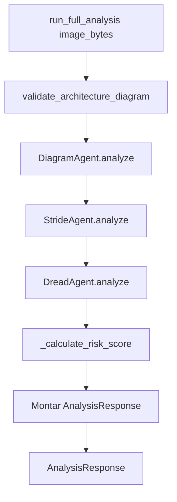

# ThreatModelService — Documentação da classe de orquestração

Este documento descreve a classe **`ThreatModelService`** do threat-analyzer: papel no sistema, cada etapa do pipeline, métodos auxiliares e pontos críticos de implementação.

---

## 1. Papel da classe no sistema

`ThreatModelService` é o **orquestrador** do pipeline de análise de ameaças. Ela:

- **Não** implementa análise de diagrama, STRIDE ou DREAD diretamente; delega a agentes especializados.
- **Coordena** a ordem das etapas (Diagram → STRIDE → DREAD), mede tempos, agrega risco e monta a resposta da API.
- **Centraliza** a criação e o ciclo de vida dos agentes (lazy loading) e a conversão dos dados brutos (dict) em schemas Pydantic.

Fluxo de chamada no threat-analyzer:

```
Router (POST /analyze) → Controller → ThreatModelService.run_full_analysis() → AnalysisResponse
```

Sem o service, o controller teria que conhecer guardrails, três agentes, fórmulas de risco e formato de resposta; o service encapsula essa complexidade.

---

## 2. Construtor

```python
def __init__(self, settings: Settings) -> None:
    self._settings = settings
    self._diagram_agent: DiagramAgent | None = None
    self._stride_agent: StrideAgent | None = None
    self._dread_agent: DreadAgent | None = None
```

**Pontos importantes:**

| Parâmetro  | Uso                                                                                                             |
| ---------- | --------------------------------------------------------------------------------------------------------------- |
| `settings` | Configuração da aplicação (API keys, RAG path, modelos LLM, etc.). Usada por todos os agentes e pelo guardrail. |

**Por que agentes são `None` no início?**  
Lazy loading: cada agente é criado na primeira vez que é acessado (via `@property`). Assim, se uma requisição falhar no guardrail ou no Diagram, os agentes STRIDE e DREAD nem são instanciados, economizando memória e tempo de inicialização.

---

## 3. Propriedades: agentes lazy-loaded

```python
@property
def diagram_agent(self) -> DiagramAgent:
    if self._diagram_agent is None:
        self._diagram_agent = DiagramAgent(self._settings)
    return self._diagram_agent
```

O mesmo padrão vale para `stride_agent` e `dread_agent`.

**Importância:**

- Cada agente pode carregar modelos, embeddings (RAG) ou conexões LLM. Criar os três na inicialização do service seria pesado e desnecessário quando há falha logo no início do pipeline.
- O singleton do service (`get_threat_model_service`) mantém as mesmas instâncias de agentes entre requisições, o que permite cache e reuso de recursos.

---

## 4. Fluxo principal: `run_full_analysis`

Visão de alto nível:



### 4.1 Guardrail: validação do diagrama

Antes de qualquer agente, a imagem passa por um **guardrail**:

```python
await validate_architecture_diagram(image_bytes, self._settings)
```

**O que faz:**

- Usa um LLM de visão (com fallback Gemini → OpenAI → Ollama) para classificar se a imagem é um **diagrama de arquitetura** (componentes, conexões, trust boundaries).
- Rejeita fotos, diagramas de sequência, fluxogramas, etc., lançando `ArchitectureDiagramValidationError`.
- Evita gastar os três estágios do pipeline em entradas que não são diagramas de arquitetura, economizando custo e tempo.

Implementação: `app/threat_analysis/guardrails/architecture_diagram_validator.py`.

---

## 5. Estágio 1: Diagram Analysis

```python
stage1_start = time.time()
logger.info("Stage 1: Diagram Analysis started")
diagram_data = await self.diagram_agent.analyze(image_bytes)
# ...
logger.info("Stage 1: Diagram Analysis complete in %.2fs (%d components, %d connections)", ...)
```

**Responsabilidade do DiagramAgent:**

- Enviar a imagem a um LLM de visão (com fallback).
- Extrair **componentes** (id, type, name, description), **conexões** (from, to, protocol) e **trust boundaries**.
- Retornar um dict com estrutura esperada pelos próximos estágios (e pelo service para montar `components`/`connections`).

**Formato típico de `diagram_data`:**

```python
{
    "model": "gemini-1.5-pro",
    "components": [{"id": "c1", "type": "Server", "name": "API Gateway", ...}],
    "connections": [{"from": "c1", "to": "c2", "protocol": "HTTPS"}],
    "boundaries": ["VPC", "Public Subnet"]
}
```

O service só repassa esse dict ao STRIDE e usa `diagram_data.get("components", [])` e `diagram_data.get("connections", [])` para logging e para montar a resposta final.

---

## 6. Estágio 2: STRIDE Analysis

```python
threats = await self.stride_agent.analyze(diagram_data)
```

**Responsabilidade do StrideAgent:**

- Receber o resultado do diagrama (componentes, conexões, boundaries).
- Opcionalmente enriquecer com **RAG** (base em `app/rag_data`, ChromaDB) para contexto de ameaças.
- Usar LLM de texto (com fallback) para identificar ameaças **STRIDE** (Spoofing, Tampering, Repudiation, Information Disclosure, Denial of Service, Elevation of Privilege) por componente/conexão.
- Retornar uma **lista de ameaças** (dicts com `component_id`, `threat_type`, `description`, `mitigation`; ainda sem pontuação DREAD).

**Por que o service só repassa `diagram_data`?**  
O contrato entre estágios é "dict in, dict/list out". O service não precisa conhecer o prompt nem o formato interno do STRIDE; isso fica encapsulado no agente.

---

## 7. Estágio 3: DREAD Scoring

```python
scored_threats = await self.dread_agent.analyze(threats)
```

**Responsabilidade do DreadAgent:**

- Receber a lista de ameaças do STRIDE.
- Para cada ameaça, atribuir pontuação **DREAD** (Damage, Reproducibility, Exploitability, Affected users, Discoverability), cada uma 1–10.
- Retornar a mesma lista de ameaças **enriquecida** com `dread_score` (média) e `dread_details`.

**Agregação de risco no service:**

```python
risk_score = self._calculate_risk_score(scored_threats)
risk_level = RiskLevel.from_score(risk_score)
```

- **Risco global** = média dos `dread_score` de todas as ameaças (0–10).
- **risk_level** = classificação (LOW/MEDIUM/HIGH/CRITICAL) a partir desse score, via `RiskLevel.from_score(score)`.

Assim, a decisão de "como agregar risco" e "como mapear score → level" fica no service; os agentes só fornecem as pontuações por ameaça.

---

## 8. Montagem da resposta final (fluxo real)

Após os três estágios, o service monta o `AnalysisResponse`:

```python
return AnalysisResponse(
    model_used=diagram_data.get("model", "Unknown"),
    components=self._parse_components(diagram_data.get("components", [])),
    connections=self._parse_connections(diagram_data.get("connections", [])),
    threats=self._parse_threats(scored_threats),
    risk_score=round(risk_score, 2),
    risk_level=risk_level,
    processing_time=processing_time,
)
```

- **model_used:** vem do DiagramAgent (modelo LLM que analisou o diagrama).
- **components / connections:** dicts brutos convertidos em listas de `Component` e `Connection` por métodos do próprio service.
- **threats:** listas de dicts convertidas em lista de `Threat` (incluindo `dread_score` e `dread_details`).
- **processing_time:** tempo total desde o início de `run_full_analysis` até ali.

Os métodos `_parse_*` garantem que erros de parsing em um item não quebrem a resposta inteira (try/except por item + log de warning).

---

## 9. Métodos auxiliares e pontos críticos

### 9.1 `_calculate_risk_score(self, threats: list[dict]) -> float`

```python
if not threats:
    return 0.0
total_score = sum(t.get("dread_score", 0) for t in threats)
return total_score / len(threats)
```

- Risco global = **média** dos `dread_score` das ameaças (0–10).
- Lista vazia → 0.0. Ameaças sem `dread_score` contam como 0.

### 9.3 `_parse_components`, `_parse_connections`, `_parse_threats`

Cada um:

- Itera sobre uma lista de dicts.
- Constrói um objeto Pydantic (`Component`, `Connection`, `Threat`) com `.get()` e valores default.
- Em torno de cada item usa `try/except`: em caso de exceção, registra `logger.warning` e **não** adiciona o item à lista de resultado.
- **Objetivo:** resiliência a respostas malformadas do LLM; a API ainda devolve 200 com os itens que foram possíveis de parsear, em vez de 500.

Exemplo (componentes):

```python
for comp in components:
    try:
        result.append(
            Component(
                id=comp.get("id", "unknown"),
                type=comp.get("type", "Unknown"),
                name=comp.get("name", "Unnamed"),
                description=comp.get("description"),
            )
        )
    except Exception as e:
        logger.warning("Failed to parse component: %s", str(e))
return result
```

---

## 10. Singleton e injeção no FastAPI: `get_threat_model_service`

```python
@lru_cache
def get_threat_model_service() -> ThreatModelService:
    settings = get_settings()
    return ThreatModelService(settings)
```

- **Singleton:** `lru_cache` sem argumentos faz com que a primeira chamada crie a instância e as seguintes reutilizem.
- **Uso:** dependency do FastAPI no router; o controller recebe o mesmo `ThreatModelService` (e portanto os mesmos agentes) em todas as requisições.
- **Testes:** para evitar chamadas reais ao LLM, os testes podem usar `app.dependency_overrides[get_threat_model_service]` para injetar um service com `run_full_analysis` mockado, ou mockar os agentes no service.

---

## 11. Resumo: importância da classe

| Aspecto          | Contribuição do ThreatModelService                                           |
| ---------------- | ---------------------------------------------------------------------------- |
| **Orquestração** | Define a ordem Diagram → STRIDE → DREAD e o fluxo de dados entre estágios.   |
| **Guardrail**    | Garante que só diagramas de arquitetura entrem no pipeline caro.             |
| **Agregação**    | Calcula risco global (média DREAD) e classifica em LOW/MEDIUM/HIGH/CRITICAL. |
| **Resiliência**  | Parsers tolerantes a falha por item e logging claro.                         |
| **Performance**  | Lazy loading dos agentes e singleton reutilizável.                           |

Sem essa classe, a lógica de orquestração, risco e resposta estaria espalhada entre controller, router e agentes; com ela, o controller apenas chama `service.run_full_analysis(bytes)` e devolve o `AnalysisResponse` à API.
