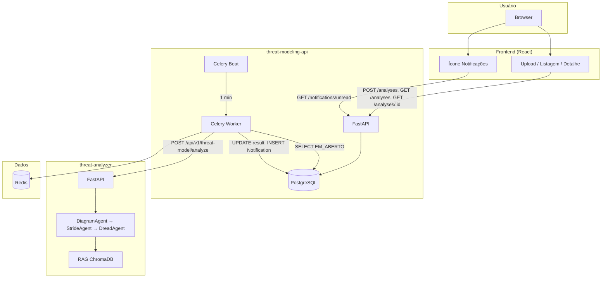
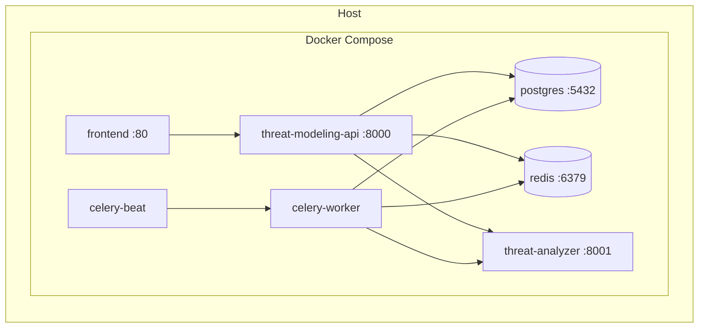

# Arquitetura — Threat Modeling AI

Visão da arquitetura do sistema: componentes, responsabilidades e diagramas.

---

## Visão geral (microserviços)

O sistema é composto por dois backends e um frontend:

- **threat-modeling-api (orquestrador):** API principal para o usuário. Gerencia análises (CRUD), imagens, status, logs e notificações. Dispara e consome o processamento assíncrono via Celery.
- **threat-analyzer:** Microserviço que executa o pipeline LLM (Diagram → STRIDE → DREAD) e retorna o resultado em JSON. Não persiste estado; chamado via HTTP pelo worker.
- **Frontend:** Consome apenas o orquestrador; upload, listagem, detalhe (polling), notificações e exibição do relatório.

---

## Diagrama de arquitetura (componentes e fluxo)

---

## Diagrama de implantação (containers)

---

## Fluxo de dados (resumo)

1. **Upload:** Frontend → POST /api/v1/analyses (multipart) → API grava imagem e registro (EM_ABERTO) → 201 com id/code.
2. **Polling:** Frontend → GET /api/v1/analyses/:id → API lê do PostgreSQL → 200 com status e result (quando ANALISADO).
3. **Background:** Celery Beat dispara worker; worker busca EM_ABERTO, atualiza PROCESSANDO, chama threat-analyzer com a imagem; analyzer devolve JSON; worker grava result, status ANALISADO e cria Notification.
4. **Notificações:** Frontend → GET /api/v1/notifications/unread → API lê do PostgreSQL → 200 com lista e contagem.

---

## Pipeline no threat-analyzer

- **Entrada:** POST /api/v1/threat-model/analyze com imagem (multipart).
- **Guardrail:** Validação LLM vision (é diagrama de arquitetura?). Se não, 400.
- **Stage 1 — DiagramAgent:** LLM vision extrai componentes e conexões.
- **Stage 2 — StrideAgent:** RAG + LLM identifica ameaças STRIDE.
- **Stage 3 — DreadAgent:** LLM aplica DREAD às ameaças.
- **Saída:** JSON (model_used, components, connections, threats, risk_score, risk_level, processing_time, etc.).

Se `USE_DUMMY_PIPELINE=true`, o DummyPipeline retorna dados fixos (testes).

---

## Decisões de arquitetura

- Processamento assíncrono com Celery (evita timeout no upload; ver ADR-0005).
- Separação orquestrador vs analyzer (escalabilidade e isolamento do pipeline LLM).
- API-first; frontend stateless que consome apenas a API do orquestrador.
- Multi-LLM com fallback no analyzer (Gemini → OpenAI → Ollama).

Detalhes em **90-decisions/** (ADRs).
