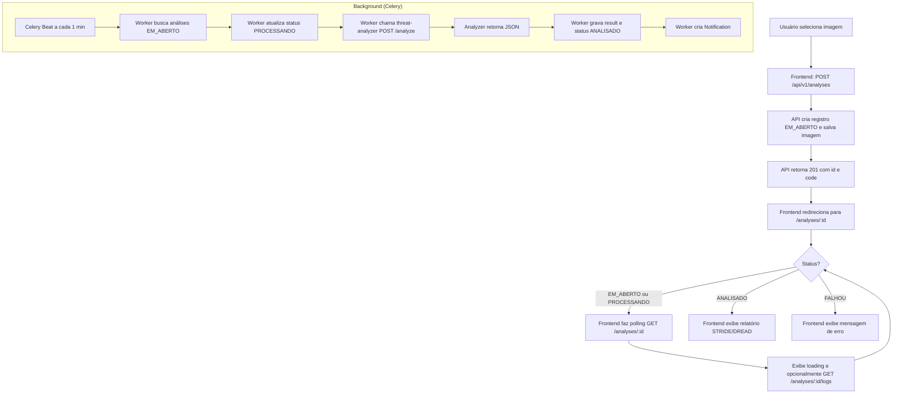

# Fluxo de análise assíncrona — Threat Modeling AI

Descrição do fluxo de uso desde o upload até a exibição do relatório.

---

## Diagrama de fluxo (usuário e sistema)

---

## Etapas (resumo)

1. **Upload:** Usuário envia imagem; API cria análise (EM_ABERTO) e retorna 201 com id e code.
2. **Redirecionamento:** Frontend redireciona para a página da análise (/analyses/:id).
3. **Polling:** Frontend consulta GET /analyses/:id em intervalo (ex.: 5s) enquanto status for EM_ABERTO ou PROCESSANDO.
4. **Logs (opcional):** GET /analyses/:id/logs para exibir logs em tempo real durante PROCESSANDO.
5. **Conclusão:** Quando status = ANALISADO, frontend exibe relatório (componentes, ameaças, risk score, risk level). Se FALHOU, exibe error_message.
6. **Notificações:** Ícone de alertas mostra contagem de não lidas (GET /notifications/unread); ao clicar em uma notificação, frontend navega para a análise correspondente. POST /notifications/:id/read marca como lida.

---

## Disparo do processamento

- Celery Beat agenda a task de varredura (ex.: a cada 1 minuto).
- O worker busca análises com status EM_ABERTO (ex.: LIMIT 1), atualiza para PROCESSANDO, envia a imagem ao threat-analyzer, recebe o JSON, grava em result, atualiza status para ANALISADO (ou FALHOU em caso de exceção) e cria uma notificação.
