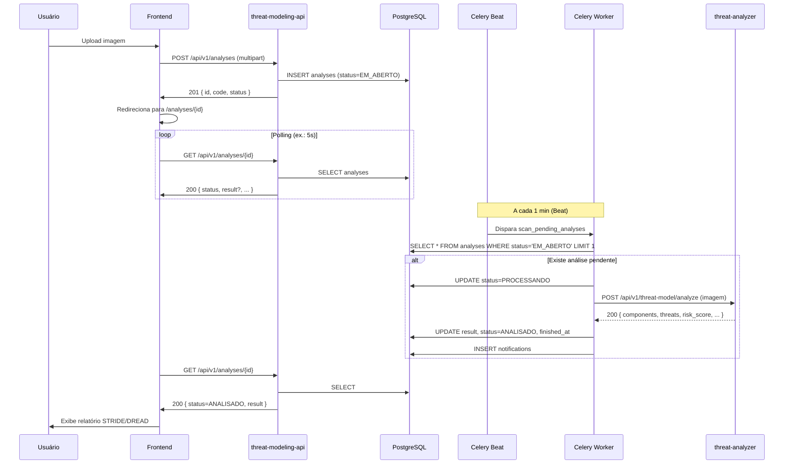
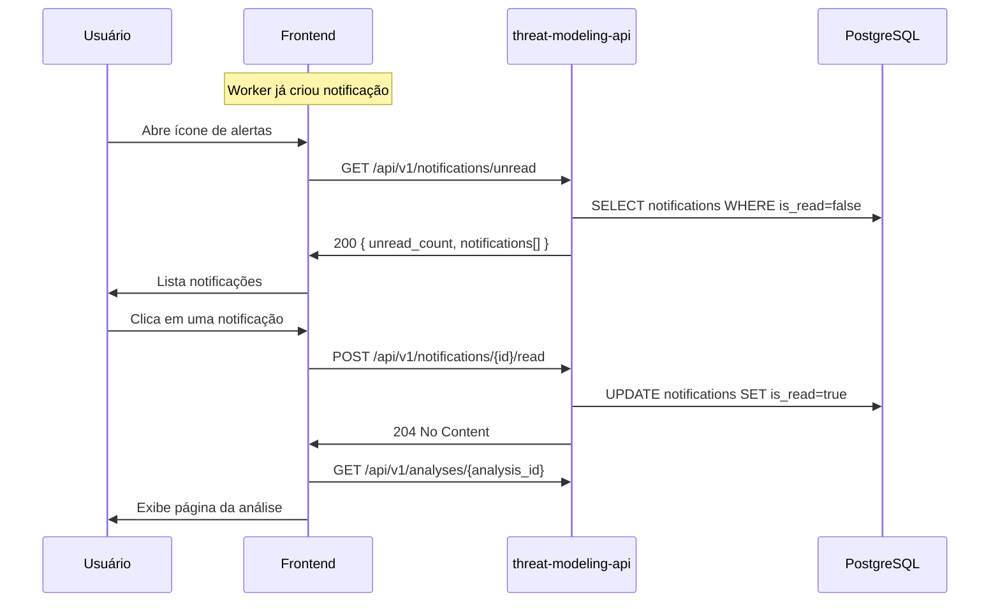

# Diagrama de sequência — Processamento assíncrono

Interação entre usuário, frontend, orquestrador, banco, Celery e threat-analyzer.

---

## Sequência principal

---

## Sequência: notificações

